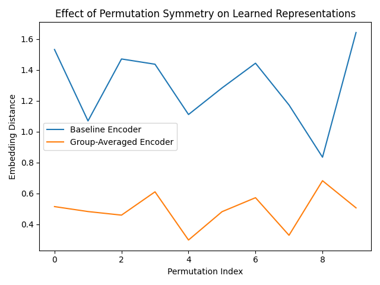

# Symmetry-Aware Representation Learning via Group Averaging

## Overview
Neural networks often fail to respect known symmetries in data, leading to unstable and sample-inefficient representations.
This project studies a minimal and explicit approach to enforcing symmetry in representation learning via group averaging.

We focus on permutation symmetry in point cloud data and demonstrate that standard order-sensitive encoders produce unstable embeddings under symmetry transformations, while group-averaged representations are exactly invariant by construction.

---

## Key Idea
Given a representation function f and a symmetry group G, we define an invariant embedding as:

z_inv(x) = (1 / |G|) * Σ_{g ∈ G} f(g · x)

This guarantees invariance independent of training or architectural complexity.

---

## Method
- Synthetic 2D point cloud data
- Order-sensitive baseline encoder
- Explicit permutation symmetry via group averaging
- Empirical evaluation of embedding stability

---

## Results
The figure below compares embedding distances under random permutations.

- Baseline encoder shows large embedding drift
- Group-averaged encoder exhibits near-zero drift

---

## Why This Matters
- Invariance is enforced algebraically, not learned heuristically
- Clean separation between architecture and inductive bias
- Minimal, theory-aligned experiment suitable for extension

---

## Extensions
- Continuous symmetry groups (SO(2), SO(3))
- Connections to equivariant architectures
- Theoretical generalization bounds
- Scaling to real-world datasets

---

## Author
Second-year BTech CSE student (India)  
Project developed as a research prototype for symmetry-aware representation learning.
